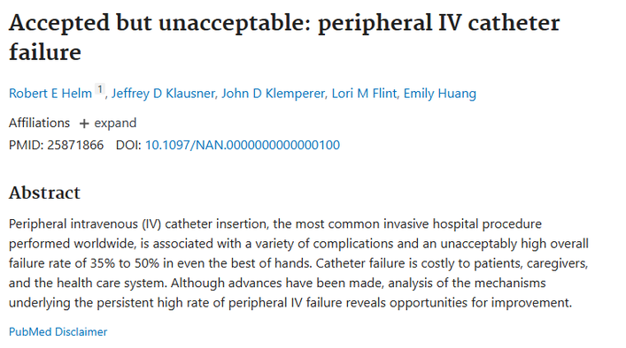

# VeinMapper Pro

VeinMapper Pro is a computer vision software prototype built to analyze infrared scans and reveal the invisible vein network.

Getting poked with a needle hurts. Getting poked three more times because they missed hurts more.

Doctors are amazing, but they aren't X-Men they can't see through skin. **1 out of every 3 adults** has veins that are difficult to find or feel, leading to painful missed sticks and treatment delays. We built this tool to solve that problem by revealing what the naked eye cannot see.

The system runs on a Flask server and renders the analysis in a real time web browser dashboard.

### Motivation

Unlike pre existing solutions that simply project an image of the vein, our goal was to build an algorithm that **mathematically identifies high risk injection areas**.

We found research indicating that peripheral IV catheter insertion has a failure rate of **35% to 50%**. By automatically detecting the structure of the veins, VeinMapper Pro helps flag specific geometric features so clinicians can make safer decisions.

### Technical Implementation

Using Python and OpenCV, we built a pipeline that processes raw infrared images in four key stages:

**Enhancing Visibility**
- We use **CLAHE** (Contrast Limited Adaptive Histogram Equalization) to reveal deep vein structures in infrared dataset images. Since raw scans are often dark or uneven, this step locally adjusts intensity to make the veins distinct from the skin.

**Segmentation and Masking**
- To separate the veins from the background, we apply **Adaptive Gaussian Thresholding**. This calculates thresholds based on neighboring pixels rather than a global value. We also generate a binary mask to identify the finger shape, ensuring we only process the relevant area.

**Skeletonization**
- We map the network by creating a biometric skeleton of the veins. The code iteratively erodes the binary image until the veins are reduced to a single pixel width, creating a clean map of the network's structure.

**Flagging Risks (Feature Detection)**
- The system analyzes the skeleton to flag critical nodes. We count the neighbors of every white pixel to automatically mark:
    * **Vein Splits (Red Dots):** Intersections where veins diverge.
    * **Endpoints (Blue Dots):** Where veins terminate.
    * This data helps clinicians know exactly where **NOT** to inject to avoid blowing a vein or hitting a valve.

### Web Interface

The project uses Flask to serve the results. The backend generates a tiled dashboard that combines the Enhanced, Binary, Skeleton, and Final Map images into a single view. The interface includes API endpoints to fetch dataset statistics and navigation controls to cycle through patient files.

### Future Improvements

We plan to upgrade the system for live hardware prototyping:
- **Hardware Integration:** Switching to specialized IR lenses for real time video capture.
- **Blood Flow Analysis:** Integrating **rPPG** (Remote Photoplethysmography) to measure blood flow speed.
- **Smart Site Selection:** Allowing doctors to select injection sites based on needs dentifying highflow areas for rapid drug absorption vs low flow areas for sustained effect.

### Dataset

We tested the code using the **Kaggle Finger Vein Dataset**, which provides the necessary infrared samples for calibration.
[Source: Kaggle Finger Vein Dataset](https://www.kaggle.com/datasets/ryeltsin/finger-vein)
